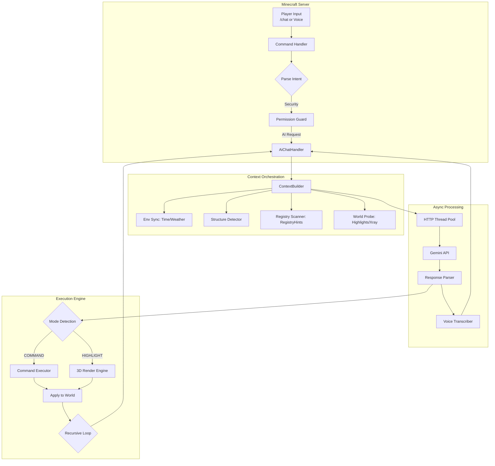

<div align="center">


# 🌌 Gemini AI Companion
### *The Next-Generation Orchestration Layer for Minecraft*

[](https://www.minecraft.net/)
[](https://fabricmc.net/)
[](https://deepmind.google/technologies/gemini/)
[](https://github.com/aaronaalmendarez/gemini-minecraft/releases/tag/v1.3.0)
[](LICENSE)

[**Quick Start**](#-getting-started) • [**Features**](#-pillars-of-intelligence) • [**Roadmap**](#-roadmap) • [**Commands**](#-command-terminal) • [**Technical Specs**](#-the-nerd-stack)

---

### *“The first AI that doesn't just talk to you—it lives in your world.”*

### *Now featuring a structured voxel architect, copy-paste MCP setup, live screenshot tools, build previews, delayed command batches, and self-repairing execution.*


</div>

## ⚡ Quick Try

1.  **Download** the latest release: [**v1.3.0 JARs**](https://github.com/aaronaalmendarez/gemini-minecraft/releases/tag/v1.3.0)
2.  Drop the `.jar` into your **`mods`** folder.
3.  Launch with **Fabric 1.21.1**.
4.  **Experience the Power**:
    *   🎙️ **Hold `V`** and speak naturally (Push-to-Talk).
    *   💬 Type `/chat <your message>` in game.

> *“Build me a small house”*  
> *“Find the nearest village”*

---

## 🎯 Who Is This For?

This project is ideal for:
- **Minecraft Modders**: Experimenting with AI-driven gameplay and orchestration.
- **AI Developers**: Interested in seeing autonomous agents operate within complex sandbox environments.
- **Server Owners**: Looking to add next-level, immersive NPC intelligence to their worlds.
- **Players**: Who want a truly unique, voice-controlled, and narrative-driven Minecraft experience.

---

## 💎 Pillars of Intelligence

Gemini AI Companion isn't just a chatbot. It's a suite of integrated systems that give the AI true digital agency.

### 🎙️ Sensory Intelligence
*The AI perceives your environment in real-time.*
- **Real-Time Voice Transcription**: Issue complex commands via voice audio—transcribed and executed instantly.
- **Structure Awareness**: The AI knows if you’re pillaging a **Bastion**, trading in a **Village**, or exploring an **Ancient City**.
- **Environmental Synchronization**: Deep awareness of server time, weather, dimensions, and nearby entities.

### 🧠 Cognitive Core
*Advanced reasoning that solves complex problems.*
- **Recursive Reasoning**: The AI can reprompt itself to chain multiple steps (e.g., `/locate` → `/tp` → `/give` resources for that biome).
- **Self-Healing Logic**: If a command fails, the AI analyzes the error, updates its logic, and retries automatically (up to 10 stages).
- **Multi-Model Support**: Switch between **Flash**, **Flash-Thinking**, and **Pro** models based on the complexity of your task.

### 🛠️ Modpack Master
*Universal compatibility for the modern player.*
- **Recipe Mastery**: Instantly retrieve complex crafting and smelting paths for **any** item (Vanilla or Modded).
- **Registry Scanner**: Automatically discovers items, blocks, and entity types from your entire modpack via RegistryHints.
- **Undo Engine**: Every AI-driven world mutation can be reverted instantly if it doesn't meet your vision.

### 🧱 Voxel Architect (NEW)
*A real structured build harness instead of fragile one-shot command spam.*
- **Structured `build_plan` Pipeline**: The AI describes builds as cuboids, block placements, palettes, rotations, and phased `steps[]` plans instead of dumping brittle raw command walls.
- **Terrain-Aware Site Scanning**: `buildsite` summaries give the model relative terrain shape, headroom, and surface composition before it commits to a house, tower, shrine, or room.
- **Phased Construction**: Large builds can decompose into foundation, walls, roof, detail, and redstone stages for better reliability and cleaner retries.
- **Safety Envelope**: Volume budgets, coordinate clamps, registry/state validation, and smarter support checks keep builds controlled and server-safe.
- **Auto-Repairing Execution**: The planner can normalize bad states, expand doors/beds, add support pillars when a build is almost right, and retry with structured error feedback when it is not.
- **World-Safe Undo**: Structured builds snapshot terrain and block-entity state so `/chat undo` can roll back the result instead of leaving permanent scars.

### 🔌 MCP Bridge (NEW)
*Bring your own external agent without replacing the in-game Gemini flow.*
- **Additive Integration**: Built-in Gemini still works exactly as before, but the mod can now expose Minecraft as a local tool service for MCP-capable desktop agents.
- **Loopback-Only Bridge**: A localhost JSON bridge runs on `127.0.0.1` with bearer-token auth and is disabled by default.
- **Out-of-the-Box Setup Flow**: `/chat mcp setup <client>` prints a ready-to-paste config block with a one-click copy button for Codex, Claude Desktop, Claude Code, Gemini CLI, OpenCode, and generic MCP clients.
- **Sidecar MCP Server**: A supported Node sidecar speaks MCP over stdio and maps external tool calls into the mod's validated bridge endpoints. The release also ships the Java sidecar jar for users who want the standalone sidecar artifact.
- **Shared Safety Surface**: MCP build execution reuses the same `build_plan` compiler, command validation, highlights, undo snapshots, and block-state guardrails as the in-game AI.
- **Single-Player v1 Focus**: The MCP path resolves one active local player automatically and returns machine-readable errors when there is no valid player context.
- **Agent-First Guidance**: MCP exposes prompts, resources, explicit help tools, planner semantics, and dry-run previews so external agents stop guessing and start using the toolchain correctly.

### 👁️ Agentic Vision (NEW)
*Image understanding as an active investigation.*
- **Think, Act, Observe Loop**: The model doesn't just "see" a static frame. it formulates plans to inspect specific screen regions and ground responses in visual evidence.
- **Visual Scratchpad**: Uses code execution to analyze pixel-perfect details, ensuring the final answer is based on a deep understanding of the current view.
- **Automated Skill Triggering**: When the AI detects a complex machine or circuit, it automatically triggers relevant scan skills to bridge the gap between "seeing" and "knowing."

### 📍 Physical Agency (v1.1.0)
*The AI interacts with the physical space.*
- **3D World Highlights**: The AI can spawn temporary holographic boxes to "point" at blocks, items, or entities.
- **X-Ray Investigation**: Visual highlights can penetrate walls, allowing the AI to guide you to hidden ores or structures.
- **Dynamic HUD Overlays**: New high-end recording and capturing overlays provide real-time status on voice and vision processes.

### 🛡️ Institutional Guardrails (v1.1.0)
*Enterprise-grade safety and governance.*
- **Multi-Player Permissions**: Granular **Whitelist/Blacklist** system to control who can access the AI.
- **Setup Wizard**: Interactive startup flow to configure API keys, performance modes, and server-wide defaults.
- **Autonomous Configuration**: The AI can analyze server performance and suggest optimal retry limits or model choices.

---

## ✨ Practical Magic: Real-World Scenarios

Stop thinking of it as a "chatbot." Start thinking of it as your **Second Pilot**.

#### 🎙️ Scenario A: The Voice Architect
> **You (Voice):** "I need a small oak starter house right here, and give me some torches."
>
> **Gemini:** *Analyzes location* → Executes `/fill` for the foundation → `/setblock` for walls/roof → `/give @p torch 16` → "Construction complete, and I've provided lighting for your safety."

#### 🧱 Scenario B: The Structured Builder
> **You:** "Build me a small oak cabin here with a door, bed, and a little roof overhang."
>
> **Gemini:** Scans the local site → emits a structured `build_plan` with cuboids, block placements, rotation, and phased steps → planner validates/repairs it → compiles it into safe `fill`/`setblock` commands → snapshots the terrain for undo → builds the cabin.

#### 🧠 Scenario C: The Recursive Scout
> **You:** "I'm lost. Find me a village, take me there, and set my spawn."
>
> **Gemini:** Executes `/locate structure village` → Parses coordinates → Executes `/tp` → Executes `/spawnpoint` → "Welcome to the village. Your spawn is secured."

<details>
<summary><b>Scenario D: The Self-Healing Engineer</b></summary>

> **You:** "Give me a sword with level 10 Sharpness."
>
> **Gemini:** *Attempts old NBT syntax* → **Minecraft returns error** → **Gemini analyzes error** → *Realizes 1.21.1 uses Components* → Re-issues command using `[minecraft:enchantments={levels:{'minecraft:sharpness':10}}]` → **Success.**

</details>

#### 📍 Scenario E: 3D Pointing (v1.1.0)
> **You:** "Where is the nearest diamond ore?"
> 
> > [!TIP]
> > **X-RAY SCAN INITIATED...**
> > ```text
> > [Scan] Found: minecraft:diamond_ore @ -42, 12, 150
> > [Render] Spawning Highlight Box...
> > ```
> > **Gemini:** "I've highlighted a diamond vein through the wall to your left. Dig approximately 12 blocks in that direction."

---

## 🖼️ Visual Exhibit

<details>
<summary><b>View Interface Screenshots</b></summary>

<div align="center">
<br>

### *“Rainbow Thinking” Feedback Interface*
The mod provides real-time, cinematic feedback via an animated action bar.


</div>
</details>

---

## 🚀 Getting Started

### 1. Prerequisites
- **Java 21** & **Fabric Loader** (1.21.1)
- A **Google Gemini API Key** ([Get one here](https://aistudio.google.com/))

### 2. Configuration Wizard (v1.1.0)
1. Drop the `.jar` into your `mods` folder and launch.
2. Type `/chat setup` to begin the interactive configuration wizard.
3. Use `/chat allow <player>` to grant AI access to specific users.

### 3. Connection
Connect your key securely using the in-game terminal:
```bash
/chatkey <your-api-key>
```
> [!TIP]
> Use `/chatkey default <key>` to set a server-wide key for all players.

---

## 🎙️ Voice Control

Gemini AI Companion features a built-in **Push-to-Talk** system for true hands-free interaction.

1. **Press & Hold `V`**: The high-end recording overlay will appear at the top of your screen.
2. **Speak Naturally**: "Build me a small oak house" or "Where is the nearest village?"
3. **Release to Execute**: The mod will instantly transcribe your audio and pass it to the Cognitive Core for processing.

---

## 📟 Command Terminal

| Command            | Description                                                          |
| :----------------- | :------------------------------------------------------------------- |
| `/chat <prompt>`   | Start a conversation (automatically triggers vision/highlights).     |
| `/chat vision`     | Force a screenshot capture and visual analysis of your view.         |
| `/chat setup`      | **Launch Wizard**: Interactive config for keys and permissions.      |
| `/chat allow/deny` | **Guardrails**: Grant or revoke player access (Whitelist/Blacklist). |
| `/chat smarter`    | Force the AI to re-evaluate the last prompt using a **Pro** model.   |
| `/chat undo`       | **Rollback** the last set of AI-executed commands.                   |
| `/chat history`    | Browse previous exchanges in an interactive menu.                    |
| `/chat config`     | Deep-dive into debug mode, sidebar toggles, and retry limits.        |
| `/chat mcp ...`    | Manage the local MCP bridge (`enable`, `disable`, `status`, `token`). |

### 🧱 Build Planning Flow

When you ask for a structure, the mod can now run a proper build loop:

1. Scan the site with `chat skill buildsite <radius>` when terrain context matters.
2. Ask the model for a structured `build_plan` instead of raw command spam.
3. Validate blocks, states, volume, coordinates, supports, and rotations.
4. Auto-repair near-miss issues like bad block states or missing support pillars.

### 🔎 MCP Debugging

You can debug the MCP server without Codex/Desktop by using the local probe client:

```bash
python3 debug-mcp-client.py --bridge-health --list-tools --call minecraft_session
```

That script:
- launches the local `gemini-minecraft` MCP server
- sends `initialize`
- optionally sends `tools/list`
- optionally calls a tool such as `minecraft_session`
- prints raw MCP request/response frames

If you want to test another tool:

```bash
python3 debug-mcp-client.py --call minecraft_buildsite --args-json '{"radius":16}'
python3 debug-mcp-client.py --call minecraft_inventory
```

If the bridge is not enabled in-game, the script will still prove whether MCP stdio itself works before the request reaches Minecraft.
5. Compile to safe Minecraft commands and snapshot the world for `/chat undo`.

This is what makes prompts like:

> *“Build me a little house here”*  
> *“Make a compact furnace shed next to me”*  
> *“Build a watchtower with a stone base and wood roof”*

feel reliable instead of random.

### 🔌 MCP Quick Start

1. In Minecraft, enable the bridge:
```bash
/chat mcp enable
```
2. Ask Minecraft for a ready-to-paste config block for your client:
```bash
/chat mcp setup codex
/chat mcp setup claude-desktop
/chat mcp setup claude-code
/chat mcp setup gemini-cli
/chat mcp setup opencode
/chat mcp setup generic
```
3. Click `[Copy]` in chat and paste the generated block into your MCP client config.
4. Restart your MCP client.

The generated config points at the supported Node sidecar and auto-reads the saved local bridge token from the project settings, so users do not need to paste tokens into MCP configs by hand.

#### Easiest Possible MCP Setup

If you want the shortest path:

1. Drop the mod jar into `mods/`
2. Launch Minecraft and join a world
3. Run `/chat mcp enable`
4. Run `/chat mcp setup codex` or your client of choice
5. Click `[Copy]`
6. Paste into the MCP client config
7. Restart the MCP client

That is it. No manual token pasting is required.

#### Release Assets

The `v1.3.0` release ships:
- `gemini-ai-companion-1.3.0.jar` for the Fabric mod
- `gemini-minecraft-mcp-sidecar.jar` for the standalone Java MCP sidecar

The recommended client path is still the generated Node sidecar config, because it includes the richest MCP guidance and best host compatibility.

Available MCP tools include:
- `minecraft_help`
- `minecraft_describe_tool`
- `minecraft_session`
- `minecraft_inventory`
- `minecraft_nearby_entities`
- `minecraft_scan_blocks`
- `minecraft_scan_containers`
- `minecraft_blockdata`
- `minecraft_players`
- `minecraft_stats`
- `minecraft_buildsite`
- `minecraft_recipe_lookup`
- `minecraft_smelt_lookup`
- `minecraft_item_lookup`
- `minecraft_item_components`
- `minecraft_batch_status`
- `minecraft_highlight`
- `minecraft_capture_view`
- `minecraft_preview_build_plan`
- `minecraft_execute_build_plan`
- `minecraft_execute_commands`
- `minecraft_undo_last_batch`

The MCP server also exposes reusable guidance, not just tools:
- Resource: `minecraft://guide/agent-workflow`
- Resource: `minecraft://guide/build-plan`
- Resource: `minecraft://guide/buildsite`
- Prompt: `minecraft_agent_guide`
- Prompt: `minecraft_build_planner`

And it now exposes explicit help tools for agents that do not proactively read MCP prompts/resources:
- `minecraft_help`
- `minecraft_describe_tool`

Those let external agents load a real operating guide for:
- when to call `minecraft_buildsite`
- when to use `minecraft_capture_view`
- when to prefer `minecraft_execute_build_plan` over raw commands
- how to plan, inspect, build, and undo safely

They also give agents explicit planner semantics instead of forcing them to guess from error messages:
- how `minDy` / `maxDy` from `minecraft_buildsite` relate to the player’s actual Y
- how the safe build window clamps relative X/Z to `[-32, 32]` and relative Y to `[-24, 24]`
- when support pillars are auto-added
- when the planner rejects a floating build instead of repairing it
- what `appliedRotation` and `phaseCount` mean in `minecraft_execute_build_plan` results
- how to dry-run a build with `minecraft_preview_build_plan` before touching the world

#### Build Plans vs Raw Commands

Use `minecraft_execute_build_plan` for real structures.

Use `minecraft_execute_commands` for one-off commands like:
- `give`
- `say`
- `time set`
- small targeted edits

It now also supports timed command sequencing by accepting either plain strings or objects with:
- `command`
- `delayTicks`
- `delayMs`

Example:

```json
{
  "commands": [
    { "command": "say intro", "delayTicks": 0 },
    { "command": "say beat", "delayTicks": 20 },
    { "command": "say finale", "delayMs": 1500 }
  ]
}
```

If any delay is present, the result returns:
- `pending`
- `batchId`

Then poll `minecraft_batch_status` until the batch completes.

The command path also now normalizes two annoying edge cases automatically:
- `\u00a7` style Unicode escapes are decoded before execution
- `effect give ... 0` is coerced to a minimum duration of `1`

For houses, huts, towers, walls, interiors, platforms, and other multi-block builds, agents should prefer `minecraft_execute_build_plan` because:
- the intent is clearer
- the planner can validate and repair the structure
- undo is cleaner as one logical batch
- it avoids huge brittle `setblock`/`fill` lists

The build-plan tool accepts either:
- a root object that is itself the build plan
- or a wrapper object with top-level `build_plan`

Important top-level planning fields:
- `coordMode`: `player` or `absolute`
- `origin`: in `player` mode this is a relative shift from the player; in `absolute` mode it is an explicit world origin
- `offset`: optional extra relative shift after the base origin
- `autoFix`: allows safe grounding fixes like small auto-lowers and limited support repair

Minimal example:

```json
{
  "summary": "Small oak hut",
  "cuboids": [
    { "name": "floor", "block": "oak_planks", "from": { "x": 0, "y": 0, "z": 0 }, "to": { "x": 4, "y": 0, "z": 4 } },
    { "name": "walls", "block": "oak_planks", "start": { "x": 0, "y": 1, "z": 0 }, "size": { "x": 5, "y": 3, "z": 5 }, "hollow": true }
  ],
  "blocks": [
    { "name": "door", "block": "oak_door", "pos": { "x": 2, "y": 1, "z": 0 }, "properties": { "facing": "south" } }
  ]
}
```

Supported aliases are intentionally flexible:
- block id: `block`, `material`, or `id`
- properties: `properties` or `state`
- geometry: `from/to`, `start/end`, `start + size`, `location + size`, `location + dimensions`

#### Planner Semantics Agents Should Follow

Agents should not treat the build planner as a black box. The most important rules are:

- `minecraft_buildsite` returns terrain deltas relative to the player’s current block Y, not absolute world Y.
- If `maxDy` is negative, the surrounding surface is below the player. A build with floor `y=0` will float unless the plan is lowered or the player moves.
- `coordMode=absolute` is the right choice when the structure needs to stay locked to a specific world location instead of wherever the player happens to be standing.
- If `coordMode=absolute` is used without `origin`, the planner falls back to the player’s block position and reports that fallback in `repairs`.
- `clearPercent` is headroom above sampled surface columns, not proof that the terrain is flat.
- The planner clamps relative X/Z into `[-32, 32]` and relative Y into `[-24, 24]`. If a plan is too large or too far away, the result includes repairs saying it was clamped into the safe build window.
- `steps` should be used for phased builds like foundation -> shell -> roof -> details.
- `clear` volumes remove space before building and use the same bounds formats as cuboids, but without a block id.
- `rotate` accepts `0`, `90`, `180`, `270`, `cw`, and `ccw`, and the result reports the final normalized value in `appliedRotation`.
- `phaseCount` reports how many direct-operation phases were compiled from `clear`, `cuboids`, `blocks`, and `steps`.
- The planner now returns structured `issues` identifying floating cuboids or block targets, their `gapBelow`, and a `suggestedY` to ground them correctly.
- The planner only adds support pillars for real unsupported columns and caps auto-support at 24 columns.
- If more than 80% of the lowest build columns are already within 2 blocks of solid ground and `autoFix=true`, the planner can auto-lower the whole build instead of spamming pillars.
- Automatic Y correction is intentionally conservative and capped to small terrain fixes. It will not bury a build deep into the ground just because one mixed-terrain column reports a large gap.
- `resolvedOrigin` in the result tells you the exact world origin that was actually used.
- `autoFixAvailable` tells you whether the planner believes a safe grounding fix exists.

If an agent gets a support-pillar failure, the correct response is usually:

1. Re-read `minecraft_buildsite`
2. Inspect `issues` and `suggestedY`
3. Lower the build or move the player to the intended surface level
4. Add a foundation phase in `steps`
5. Retry with a grounded plan

Do not keep retrying the same floating `y=0` structure and assume the JSON schema is wrong.

#### Preview Before Commit

For terrain-sensitive or unfamiliar builds, agents should use:

1. `minecraft_buildsite`
2. `minecraft_preview_build_plan`
3. Inspect:
   - `repairs`
   - `appliedRotation`
   - `phaseCount`
   - `resolvedOrigin`
   - `issues`
   - `previewCommands`
4. Save the returned `planId` if the preview looks good
5. Revise the plan if needed
6. Then call `minecraft_execute_build_plan`

Best practice is:

```json
{ "executePlanId": "plan-..." }
```

That makes execute run the exact cached preview instead of recompiling a fresh variant.

`minecraft_preview_build_plan` uses the same planner and command validation as the real build path, but it does not mutate the world and does not create an undo batch.

#### Recommended MCP Help Calls

For weaker or unfamiliar agents, explicitly call:

- `minecraft_help { "topic": "workflow" }`
- `minecraft_help { "topic": "build-plan", "task": "build a small house" }`
- `minecraft_help { "topic": "buildsite" }`
- `minecraft_describe_tool { "name": "minecraft_buildsite" }`
- `minecraft_describe_tool { "name": "minecraft_execute_build_plan" }`

That is the fastest way to load the planner contract before attempting a real structure.

---

## 🛠️ The Nerd Stack

<details>
<summary><b>📐 System Architecture</b> (Mermaid Diagram)</summary>


</details>

---

## 🗺️ Roadmap

- [x] **AI Vision (Screenshots)**: Visual frame analysis.
- [x] **3D Physical Agency**: World highlights and pointing.
- [x] **Permission Guardrails**: Whitelist/Blacklist management.
- [ ] **Multiplayer-Aware Memory**: Shared AI context between players.
- [ ] **Voice Synthesis (TTS)**: The AI talks back to you.
- [ ] **Plugin API**: Custom behaviors/skills for creators.

---

## 🤝 Contributing

Contributions are what make the open-source community an amazing place to learn, inspire, and create. Please see [CONTRIBUTING.md](CONTRIBUTING.md) for guidelines on how to get started.

---

<div align="center">

### *Elevate your Minecraft experience today.*

[**Download for Fabric**](https://fabricmc.net/) | [**Report a Bug**](https://github.com/aaronaalmendarez/gemini-minecraft/issues)

---

### *Built with ❤️ for the Minecraft Community*

</div>
